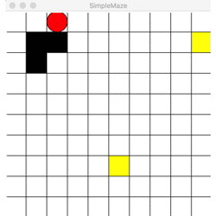

# RL-Gridworld

## Introduction
RL-Gridworld is a simple project to implement grid world environment, like: maze. You can also implement your agent under `/agent`.

PR and fork are welcome :)

## Install Dependency
In this project, I use `CPU-version pytorch` to implement my agent.

you can run the following method to create virtual environment for this project.

```
virtualenv -p python3.5 venv
source venv/bin/activate
pip install -r requirements.txt
```

## File Structure
- agent package: We can implement the AI agent here.
- env package: Defined environment base class, grid etc.
- maze package: I put a example maze here, which is inherit from env.env.GridWorld
- models directory: store pre-trained model here.
- a2c_client.py: A script to train A2C Agent.
- deep_q_client.py: A script to train Deep Q Agent.
- play.py: A example to demonstrate the interaction between SimpleMaze and AI agent.

## Give it a Try!
Just run the `play.py`
```
(venv)$ python play.py
```


## License
The MIT License

